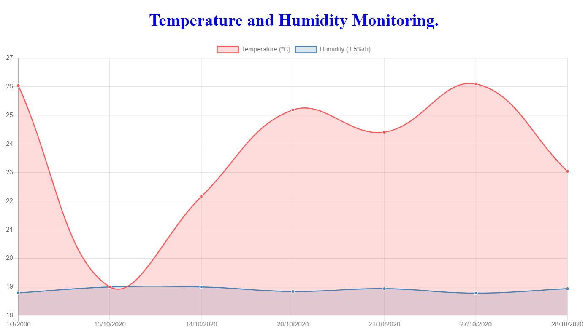
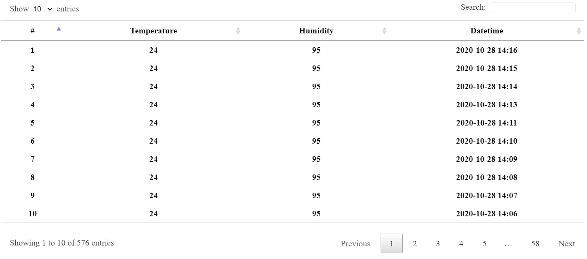

# temp_rtc




## Features

- สามารถจักเก็บข้อมูล อุณหภูมิ ความชื้น เวลา โดยใช้ Python อ่านข้อมูลและส่ง http post ไปยัง server
- สามารถอ่านข้อมูลจาก Sensor อุณหภูมิ ความชื้น เวลา ที่ถูกเก็บบนฐานข้อมูล

## จัดเก็บข้อมูลใน Database

### อ่านข้อมูลจาก Sensor โดยใช้ Python
```py
import sys
import Adafruit_DHT
import busio
import adafruit_ds3231
from board import *

rtcI2C=busio.I2C(SCL,SDA)
rtc=adafruit_ds3231.DS3231(rtcI2C)

t=rtc.datetime

while True:
    humidity, temperature = Adafruit_DHT.read_retry(11,24)
    if humidity is not None and temperature is not None:
        tempSensorRTC={
            "temperature":temerature,
            "humidity": humidity,
            "year": t.tm_year,
            "month": t.tm_mon,
            "day": t.tm_mday,
            "hour": t.tm_hour,
            "minute": t.tm_min
        }
        print(tempSensorRTC)
```

### ส่งข้อมูลไปยัง server โดยใช้ hppt post
```py
import requests

tempSensorRTC={...}
requests.post('http://localhost:3009/addData',tempSensorRTC)
```